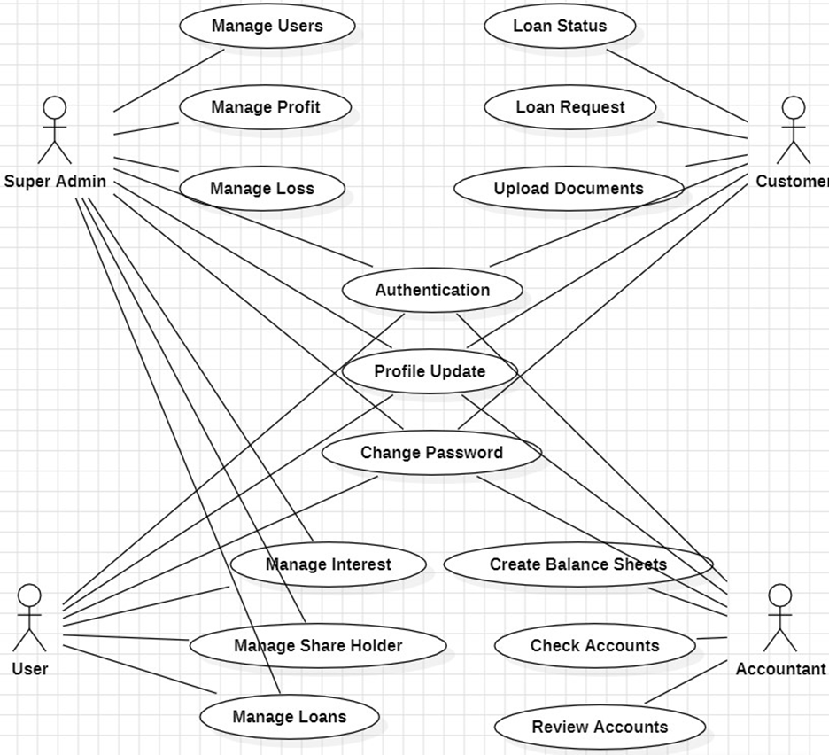
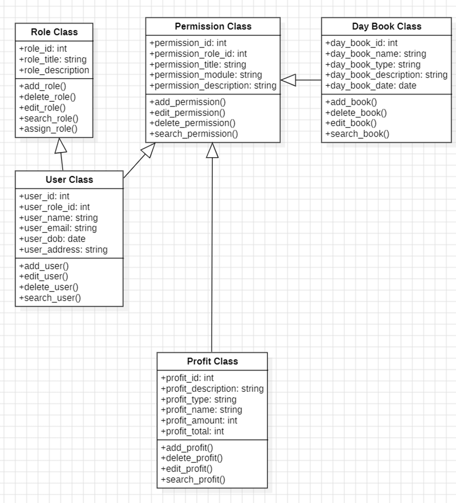

## Purpose : 
A bank account application using Angular.js. A simple bank account application that allows the fictitious ‘EA Bank’ to create customers, who can have a balance in a given currency. Customer can also use the system to add and remove amounts to and from their account. Once a
deposit or withdrawal takes place, it should be listed along with the date and time the transaction took place.

## Used Technology :
* Angular.js for client side code 
* node.js for server side
* Jasmine and Karma for testing

## UseCase Diagram

## Class Diagram
